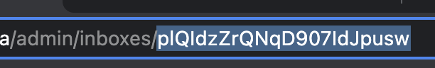
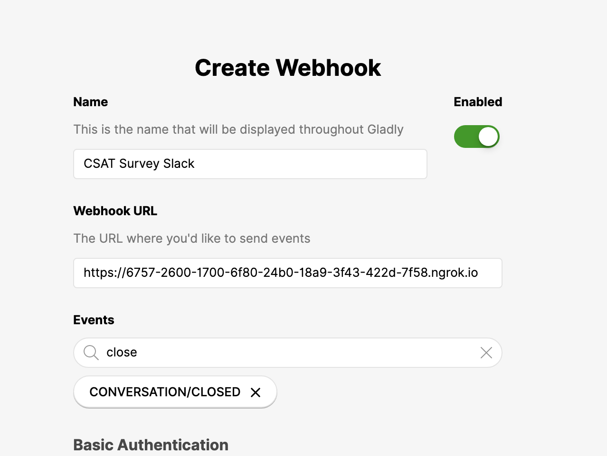
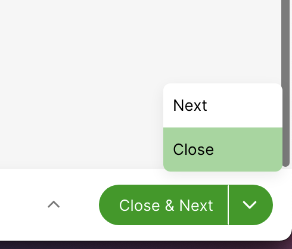

# Background

This repository contains code examples, written in node.js, depicting common use cases for how to utilize Gladly REST API and Webhooks.

This repository should be used as a tool for **learning** and not as production code!

# Setup

## Step 1: Generate Gladly API token

Please follow [these](https://developer.gladly.com/rest/#section/Getting-Started/Creating-API-Tokens) instructions to create an API token.

## Step 2: Setup Gladly

To run the apps in this tutorial, you'll need to set up a few other things in Gladly:

### Backend Chatbot
1. [Create an inbox](https://help.gladly.com/docs/create-edit-and-deactivate-inboxes#create-an-inbox) in Gladly called `Escalations`. Click into the pencil icon next to the newly created inbox, and copy the inbox ID in the URL to a safe space. In the example below, the inbox ID is `plQIdzZrQNqD907IdJpusw`:

2. [Create an inbox](https://help.gladly.com/docs/create-edit-and-deactivate-inboxes#create-an-inbox) in Gladly called `All`. There is no need to copy this inbox ID.
3. [Create a Gladly Sidekick](https://help.gladly.com/docs/create-and-configure-sidekick), setting the hours to 24/7. Click on [View Preview](https://help.gladly.com/docs/create-and-configure-sidekick#preview-and-embed-sidekick) to get a link to preview and interact with your Sidekick.
4. In the Channel Settings page, [route chat messages to the All inbox you created in step 2.2](https://help.gladly.com/docs/set-up-channels-and-entry-points#route-requests-to-a-particular-inbox-based-on-the-entry-point)
5. [Create a Topic](https://help.gladly.com/docs/adding-and-managing-topics#create-a-topic) in Gladly and call it `CHATBOT - SKIP`. Click into the pencil icon next to the newly created inbox, and copy the topic ID in the URL to a safe space. In the example below, the topic ID is `-neHAPf6Qo6e_ZxD1QKaPA`:

6. [Create a Topic](https://help.gladly.com/docs/adding-and-managing-topics#create-a-topic) in Gladly and call it `CHATBOT - DEFAULT PROCESSED`. Click into the pencil icon next to the newly created inbox, and copy the topic ID in the URL to a safe space
7. Go to the Users page in Gladly and grab the agent ID of the API User you created in Step 1 from the URL. Click into the API User you created and assign this agent to the `All` inbox. Copy the agent ID in the URL to a safe space.  In the example below, the topic ID is `XeEJwrnuTfabHMK5ZW1fGg`:


### CSAT Survey
8. Create a [messaging webhook URL](https://api.slack.com/messaging/webhooks) for a Slack channel of your choice and save this to a safe space

## Step 3: Setup .env file

Now, you can set up your environment variables. To do so, copy the `.env-sample` file found in the root folder of this repository into a new file called `.env` (also to be created at the root folder of this repository).

Set the following:
- `GLADLY_HOST`: Set this to your Gladly URL (e.g.: https://sandbox.gladly.qa), making sure to not have an ending `/` at the end and including the `https://` protocol at the beginning
- `GLADLY_USERNAME`: Your Gladly developer email address (e.g.: gladlyadmin@gladly.com)
- `GLADLY_API_TOKEN`: The API token that you generated in Step 1
- `CHATBOT_AGENT_ID`: The agent ID you copied in Step 2.7
- `CHATBOT_EXCLUDE_TOPIC_ID`: The topic ID you copied in Step 2.5
- `CHATBOT_DEFAULT_TOPIC_ID`: The topic ID you copied in Step 2.6
- `CHATBOT_MOVE_TO_INBOX_ID`: The inbox ID you copied in Step 2.1
- `CSAT_SLACK_WEBHOOK`: The Slack webhook URL you copied in Step 2.8

Save the file

## Step 4: Install node modules

Make sure you are in the root directory of this repository on Terminal, then run this command:

`yarn install`

## Step 5: Setup ngrok

This repository uses ngrok to make the Lookup Adapter endpoint publicly accessible
- Create an account on [ngrok](https://dashboard.ngrok.com/signup) if you don't already have one
- Go [here](https://dashboard.ngrok.com/get-started/setup) and follow the instructions in Step 1 & 2 to install `ngrok`
- Download the ngrok binary to your local machine - you will likely need grant permission to use it in your `System Preferences > Security and Privacy` settings

# Sample Applications

## Backend Chatbot

### What this does

In a nutshell, this application allows you to embed Gladly Sidekick on your front-end website or mobile app, but respond to messages using a back-end bot. When the bot determines it needs to pass off the interaction to a real human, the bot reassigns the conversation to another inbox and does not process messages on this conversation anymore.

### Running this app

1. Open up Terminal. In the root directory of this repository, type in `node backend-chatbot`
2. In a new tab on Terminal, type in `ngrok http 8000` and copy the HTTPS link
3. Go to `More Settings > Webhooks` in Gladly and create a webhook for `MESSAGE/RECEIVED` using the HTTPS link you just copied. Leave all other fields blank - you can name this webhook whatever you'd like.


### Testing

1. Login to Gladly as an Administrator and click into the `All` inbox that you set up in Step 2.2
2. In a new tab, go to the Sidekick preview link you generated in Step 2.3 and start a chat session:

3. You will then receive an automated response with the following text. This is a message sent by the app!

4. Find the conversation in Gladly by typing in the email address you used to start the chat session on the preview link. Note that the agent you configured in Step 2.7 is assigned to the conversation!


5. Type in `show me quick reply buttons`. The chat widget will respond with a list of options in button format.

6. Press `goodbye`. You will receive a chat ended notification.

7. Go back to Gladly. Note that the conversation has been closed automatically by this app, and the topic you set up in Step 2.6 has been assigned.

8. Go back to the chat preview link. Type in `agent`. Notice that no auto-reply occurs!

9. Go back to Gladly. Notice that the conversation has been reopened due to you re-initiating the chat, and that this app has added the topic you configured in Step 2.5 in, and reassigned the conversation to the inbox you configured in Step 2.1.

10. Go back to the chat preview link and type in anything you'd like. Notice that the bot has stopped responding!

### How it accomplishes this

1. The app listens to the `MESSAGE/RECEIVED` or `PING` webhook `POST` requests made by Gladly
2. If it receives any other type of webhook, it stops processing the request and sends back a `500` HTTP status code
3. If it is a `PING` webhook, it will respond back with HTTP 200. This is Gladly's way of checking if the webhook is alive. Gladly will not allow you to save the webhook in the Gladly UI **if your app does not send back a HTTP 200 OK status code** on the `PING` event
4. Otherwise, upon `MESSAGE/RECEIVED`, the app will get the conversation details using the webhook's `content.conversationId` field and the [Get Conversation](https://developer.gladly.com/rest/#operation/getConversation) API.
5. If the conversation status is currently `CLOSED` (this can happen if the conversation got closed by a rule or agent before the application processes the webhook request), the app sends back a `200` HTTP status code and stops processing the request.
6. Otherwise, the app will check to see if the conversation is tagged with the topic ID configured in `CHATBOT_EXCLUDE_TOPIC_ID`. This topic ID indicates that the chatbot has "given up" and needs a human to respond, so it will not try to respond back to the customer or process this chat message. The list of topic IDs applied to the conversation can be found in the `topicIds` array of the conversation retrieved in Step 4 of this section. Note if no topics are applied, then `topicIds` may not exist! If the `CHATBOT_EXCLUDE_TOPIC_ID` is applied to this conversation, the app sends back a `200` HTTP status code and stops processing the request.
7. Otherwise, the app will retrieve the conversation item details using the webhook's `content.conversationItemId` field and the [Get Conversation Item](https://developer.gladly.com/rest/#operation/getItem) API.
8. **SKIPS PROCESSING IF MESSAGE RECEIVED IS NOT A CHAT MESSAGE**: If the `content.type` in the conversation item you retrieved in Step 7 of this section is **NOT** `CHAT_MESSAGE`, the app will move the conversation to the `Escalated` inbox you configured in Step 2.1, and add the `CHATBOT_EXCLUDE_TOPIC_ID` topic to the conversation using the [Update Conversation](https://developer.gladly.com/rest/#operation/patchConversation) API and [Add Topic to Conversation](https://developer.gladly.com/rest/#operation/addTopicToConversation) API. From here forward, the app will no longer perform any automated actions on this conversation, even if the Customer eventually switches back to using the Chat channel. In reality, there are a number of ways to achieve this. For example, you can route all non-chat messages to a different inbox using [Gladly rules](https://help.gladly.com/docs/what-are-rules), and just check that the `inboxId` specified in the conversation you retrieved in step 5 of this section matches the inbox whose messages you want to process!
9. **ESCALATES TO A REAL AGENT WHEN APPROPRIATE**: If the `content.content` of the conversation item you retrieved in Step 7 of this section contains the word `agent` (case-insensitive), the app will move the conversation to the `Escalated` inbox you configured in Step 2.1, and add the `CHATBOT_EXCLUDE_TOPIC_ID` topic to the conversation using the same APIs as Step 8 in this section. From here forward, the app will no longer perform any automated actions on this conversation. In reality, there are a number of ways to accomplish this behavior of escalating a particular chat message to an agent (e.g.: assigning to another inbox that the app does not "watch", or assigning to a **specific** agent and not processing any conversations currently assigned to another agent).
10. **CLOSES CONVERSATION WHEN APPROPRIATE**: If the `content.content` of the conversation item you retrieved in Step 7 of this section contains the phrase `goodbye` (case-insensitive), the app will add the `CHATBOT_DEFAULT_TOPIC_ID` topic ID, and then close the conversation using the [Add Topic to Conversation](https://developer.gladly.com/rest/#operation/addTopicToConversation) and [Update Conversation](https://developer.gladly.com/rest/#operation/patchConversation) APIs. Note that it is **integral** to add the topic ID prior to closing the conversation if your Gladly instance has been set up to require topics! In reality, you'll want to make sure you're tagging the conversation using the right topic ID, instead of just a default one. You may wish to do this by calling the [List Topics API](https://developer.gladly.com/rest/#operation/getTopics) and finding the most appropriate topic to tag this conversation with.
11. **SHOWS QUICK REPLY BUTTONS WHEN APPROPRIATE**: If the `content.content` of the conversation item you retrieved in Step 7 of this section contains the phrase `show me quick reply buttons` (case-insensitive), the app will assign the conversation to the `CHATBOT_AGENT_ID` configured using the [Update Conversation](https://developer.gladly.com/rest/#operation/patchConversation) API and use the [Reply to Message](https://developer.gladly.com/rest/#operation/replyToMessage) API to show options the customer can respond with in button format.
12. **AUTO-RESPONDS TO CHAT WHEN APPROPRIATE**: Otherwise, the application will send a reply to the Customer using the [Reply to Message API](https://developer.gladly.com/rest/#operation/replyToMessage) and assign the conversation to the `CHATBOT_AGENT_ID` configured using the [Update Conversation](https://developer.gladly.com/rest/#operation/patchConversation) API.

## CSAT Survey

### What this does

In a nutshell, this application will send a message to a channel on Slack when a conversation is closed suggesting to send out a CSAT survey. In the real world, you'll likely want to replace the call to Slack with a real CSAT survey provider.  

It is **very important** to handle customer information with utmost care. Please check with the appropriate representatives and personnel at your company to ensure you are abiding by security standards. This tutorial logs information to Slack as a learning mechanism **only** and should **never be used in a production environment**.

### Running this app

1. Open up Terminal. In the root directory of this repository, type in `node csat-survey`
2. In a new tab on Terminal, type in `ngrok http 9000` and copy the HTTPS link
3. Go to `More Settings > Webhooks` in Gladly and create a webhook for `CONVERSATION/CLOSED` using the HTTPS link you just copied. Leave all other fields blank - you can name this webhook whatever you'd like.


### Testing

1. Login to Gladly as an Administrator
2. Create a [new customer profile](https://help.gladly.com/docs/add-a-new-customer-profile), adding the email address (e.g.: your own email address) into the profile and a phone number (if you'd like)

3. Click on the `+` button at the bottom of the profile to create a new conversation, and then click on `Email` to initiate an outbound email
4. Respond to the email. In a few minutes, your response should appear in the customer profile you created, like this:

5. Add a topic to the conversation in Gladly:

6. Close the conversation by clicking on the down arrow and then clicking on `Close`

7. You'll now see a message on the Slack channel you associated with this app in Step 2.8 that looks like the following:


### How it accomplishes this

1. The app listens to the `CONVERSATION/CLOSED` or `PING` webhook `POST` requests made by Gladly
2. If it receives any other type of webhook, it stops processing the request and sends back a `500` HTTP status code
3. If it is a `PING` webhook, it will respond back with HTTP 200. This is Gladly's way of checking if the webhook is alive. Gladly will not allow you to save the webhook in the Gladly UI **if your app does not send back a HTTP 200 OK status code** on the `PING` event
4. Otherwise, upon `CONVERSATION/CLOSED`, the app will get the conversation details using the webhook's `content.conversationId` field and the [Get Conversation](https://developer.gladly.com/rest/#operation/getConversation), [Get Conversation Items](https://developer.gladly.com/rest/#operation/getConversationItems) APIs.
5. The app will also retrieve the customer profile in Gladly using the webhook's `content.customerId` field and the [GET Customer](https://developer.gladly.com/rest/#operation/getCustomer) API
6. Finally, the app will retrieve a list of agents on Gladly using the [List Agents](https://developer.gladly.com/rest/#operation/getAgents) API
7. The app will then post a Slack message using the Slack webhook configured in step 2.8 using the following information format:
```
Conversation ${thisConversationId} was closed on ${conversation.closedAt}. Please send a CSAT survey request. Details below:\n\nAgent Email: ${(currentAgent && currentAgent.length) ? currentAgent[0].emailAddress : 'N/A'}\nCurrent Inbox ID: ${currentInboxId}\nTopic IDs: ${topicIds}\nCustomer Emails: ${customerEmails}\nCustomer Phones: ${customerPhones}
```
  - `thisConversationId` is set to the conversation ID in the webhook payload (`content.conversationId`)
  - `conversation.closedAt` is set to the conversation's `closedAt` value that was retrieved in Step 4 of this section
  - `currentAgent` is set to the agent's email address. The agent's email address is retrieved from the list of agents you grabbed in Step 6 of this section: the `id` of the agent in this list is matched to the `agentId` in the conversation information you retrieved in Step 4 of this section.
  - `currentInboxId` is set to the conversation's `inboxId` value that was retrieved in Step 4 of this section
  - `customerEmails` is set to the list of customer email addresses retrieved in the `emails` array via the customer information retrieved in Step 6 of this section
  - `customerPhones` is set to the list of customer email addresses retrieved in the `emails` array via the customer information retrieved in Step 6 of this section
